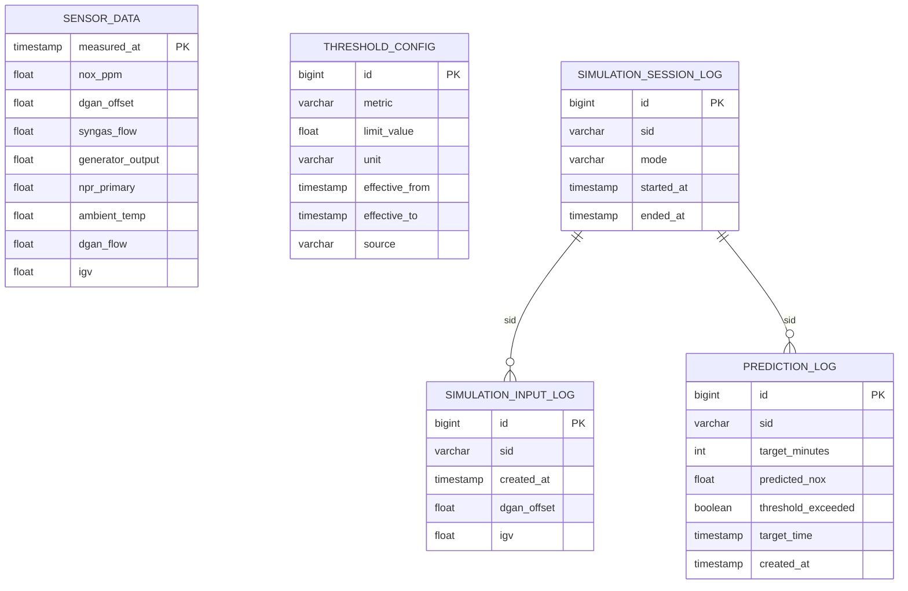

# 데이터베이스 및 컬럼 정의서 (v1.1)

본 문서는 IGCC NOx 예측 디지털 트윈 프로젝트의 데이터 엔지니어링 파트 표준 정의서입니다.
백엔드 API, 프론트엔드 차트, ETL 스크립트는 본 문서의 운영 컬럼명을 기준으로 개발합니다.

---

## 1. 데이터셋 운용 기준

원천 데이터는 2025년 8월 11일부터 2025년 8월 25일까지의 IGCC 가스터빈 운전 센서 데이터입니다.
원본 CSV는 wide-format이며, `TagName` 컬럼이 측정 시각 역할을 합니다.

| 파일 | 기간 | 용도 | Git 관리 |
| :--- | :--- | :--- | :--- |
| `NOx_train_20250811_20250824.csv` | 2025-08-11 ~ 2025-08-24 | 모델 학습, 초기 DB 적재, 서비스 기준 데이터 | 제외 |
| `NOx_test_20250825.csv` | 2025-08-25 | Kafka 실시간 스트리밍 시뮬레이션 입력 | 제외 |

`data/**` 하위 CSV는 용량과 보안/운영 편의 때문에 Git에 올리지 않습니다.
로컬과 EC2에는 필요 시 직접 복사하거나, 추후 S3에서 내려받는 방식으로 관리합니다.

---

## 2. 운영 테이블 컬럼 매핑

현재 운영 DB에는 원천 CSV의 모든 센서 컬럼을 저장하지 않고, 백엔드/프론트/모델 서빙에 필요한 핵심 9개 컬럼만 `sensor_data`에 적재합니다.
원천 전체 컬럼은 본 문서의 "원천 컬럼 사전"에 따로 기록합니다.

| 원본 TagName (CSV) | 변경 후 컬럼명 (DB) | 데이터 타입 | 논리명 | 역할 |
| :--- | :--- | :--- | :--- | :--- |
| `TagName` | `measured_at` | TIMESTAMP | 측정 시간 | Primary Key |
| `IGCC.DeNOX.AT_H1_901_PV` | `nox_ppm` | FLOAT | 가스터빈 후단 NOx 농도 | Target |
| `IGCC.CC.G1.NQKR3_MONITOR` | `dgan_offset` | FLOAT | 희석질소 오프셋 | Control |
| `IGCC.CC.G1.ca_fqsg_cl` | `syngas_flow` | FLOAT | 합성가스 유량 | Feature |
| `IGCC.CC.G1.DWATT` | `generator_output` | FLOAT | 발전기 출력 | Feature |
| `IGCC.CC.G1.VNPR_P` | `npr_primary` | FLOAT | NPR Primary | Feature |
| `IGCC.CC.G1.ATID` | `ambient_temp` | FLOAT | 대기 온도 | Feature |
| `IGCC.CC.G1.NQJ` | `dgan_flow` | FLOAT | 희석질소 유량 | Feature |
| `IGCC.CC.G1.csgv` | `igv` | FLOAT | IGV 개도 | Feature |

---

## 3. 적재 및 전처리 규칙

### 3.1. 데이터 정제

* 원본 CSV의 상단 1~4행(`Description`, `Units`, `Plot Min`, `Plot Max`)은 적재 시 제외합니다.
* `IGCC.CC.G1.ttfr1`은 유효 데이터가 매우 적어 분석/적재에서 제외합니다.
* `Column1`은 전체 결측 컬럼으로 적재하지 않습니다.
* 핵심 9개 컬럼 중 하나라도 결측이 있는 행은 제거합니다.
* `measured_at`은 `TIMESTAMP`로 변환하며 변환 실패 행은 제거합니다.

### 3.2. 적재 환경

| 항목 | 값 |
| :--- | :--- |
| DBMS | PostgreSQL 15 |
| 데이터베이스명 | `igcc_db` |
| 운영 테이블명 | `sensor_data` |
| 로컬/EC2 기본 계정 | `.env`의 `POSTGRES_USER`, `POSTGRES_PASSWORD` 기준 |

EC2 검증 기준으로 train 데이터 적재 결과는 다음과 같습니다.

| 데이터 | 행 수 | 측정 범위 |
| :--- | ---: | :--- |
| train | 1,209,599 | 2025-08-11 00:00:00 ~ 2025-08-24 23:59:59 |

---

## 4. ERD 기준

현재 실제 DB 연동이 확정된 테이블은 `sensor_data`와 `threshold_config`입니다.
시뮬레이션 세션/입력/예측 로그 테이블은 백엔드 기능 확장 시 추가합니다.

---

## 5. 원천 컬럼 사전

`info.md`의 원천 센서 컬럼 정의를 기준으로 정리한 데이터 사전입니다.
이 표는 원천 데이터 이해와 향후 피처 확장을 위한 기준이며, 모든 컬럼을 운영 DB에 즉시 적재한다는 의미는 아닙니다.

| 컬럼명 | 설명 | 단위 | 제어 가능 여부 |
| :--- | :--- | :--- | :--- |
| `TagName` | 타임스탬프 | - | 아니오 |
| `IGCC.CC.G1.FPSG` | 합성가스 공급 압력 | kg/cm2 | 아니오 |
| `IGCC.CC.G1.FTSG` | 합성가스 공급 온도 | degC | 아니오 |
| `IGCC.CC.G1.ca_fqsg_cl` | 합성가스 유량 보정값 | kg/s | 아니오 |
| `IGCC.CC.G1.LHVSYNDW_SCF` | 합성가스 저위발열량 계산값 | kJ/m3 | 아니오 |
| `IGCC.CC.G1.FSAGR` | 연료제어밸브 VSR-11 개도 | percent | 예 |
| `IGCC.CC.G1.FPSG2` | 1차 제어 후 연료 압력 | kg/cm2 | 아니오 |
| `IGCC.CC.G1.FSAG11A` | 연료제어밸브 VSR-11A 개도 | percent | 예 |
| `IGCC.CC.G1.FSAG11` | 연료제어밸브 VSR-11 개도 | percent | 예 |
| `IGCC.CC.G1.FSAG12` | 연료제어밸브 VSR-12 개도 | percent | 예 |
| `IGCC.CC.G1.FPSG3` | 연료기 주입 전 연료 압력 | kg/cm2 | 아니오 |
| `IGCC.CC.G1.DWATT` | 발전기 출력 | MW | 아니오 |
| `IGCC.CC.G1.AFDPM` | 압축기 필터 차압 | mmH2O | 아니오 |
| `IGCC.CC.G1.CTIM` | 압축기 입구 온도 | degC | 아니오 |
| `IGCC.CC.G1.afpap` | 대기 압력 | mmHg | 아니오 |
| `IGCC.CC.G1.csgv` | IGV 개도 | degree | 예 |
| `IGCC.CC.G1.CPD` | 가스터빈 압축기 출구 압력 | kg/cm2 | 아니오 |
| `IGCC.CC.G1.CTD` | 가스터빈 압축기 출구 온도 | degC | 아니오 |
| `IGCC.CC.G1.CSBHX` | IBH 밸브 개도 | percent | 예 |
| `IGCC.CC.G1.tnh_v` | 가스터빈 속도 | rpm | 아니오 |
| `IGCC.CC.G1.ATID` | 대기온도 | degC | 아니오 |
| `IGCC.CC.G1.EXHMASS` | 배기가스 유량 | kg/s | 아니오 |
| `IGCC.CC.G1.TTXM` | 배기가스 온도 | degC | 아니오 |
| `IGCC.CC.G1.FPGN1_SEL` | Primary Manifold 차압 | kg/cm2 | 아니오 |
| `IGCC.CC.G1.FPGN2_SEL` | Secondary Manifold 차압 | kg/cm2 | 아니오 |
| `IGCC.CC.G1.ROUTPUT_32` | 연소기 캔 압력 시뮬레이션값 | - | 아니오 |
| `IGCC.CC.G1.VNPR_S` | NPR Secondary Manifold | ratio | 아니오 |
| `IGCC.CC.G1.VNPR_P` | NPR Primary Manifold | ratio | 아니오 |
| `IGCC.CC.G1.NPNJ` | DGAN 질소가스 공급 압력 | kg/cm2 | 아니오 |
| `IGCC.CC.G1.NTNJ` | DGAN 질소가스 온도 | degC | 아니오 |
| `IGCC.CC.G1.NQJ` | DGAN 질소가스 유량 | kg/s | 예 |
| `IGCC.CC.G1.NQJO2` | 질소가스 내 산소 순도 | percent vol | 아니오 |
| `IGCC.CC.G1.nicvs1` | 질소가스 제어밸브 개도 | percent | 예 |
| `IGCC.CC.G1.ndt1` | 제어밸브 후단 질소가스 온도 | degC | 아니오 |
| `IGCC.CC.G1.NPNJ2` | 제어밸브 후단 질소가스 압력 | kg/cm2 | 아니오 |
| `IGCC.CC.G1.NQKR3_MONITOR` | 연료 대비 질소가스 주입 오프셋 | kg/s | 예 |
| `IGCC.CC.G1.ROUTPUT_6` | 연소온도 간접값 | - | 아니오 |
| `IGCC.IG.PIC7069A.PV` | DGAN 흡입 전단 질소 대기 방출 압력 | - | 아니오 |
| `IGCC.IG.ZT7069B.PV` | DGAN 흡입 전단 대기 방출 제어밸브 개도 | - | 예 |
| `IGCC.DeNOX.AT_H1_901_PV` | 가스터빈 후단 NOx 농도 | ppm | 아니오 |
| `IGCC.DeNOX.AIT_H1_902` | 가스터빈 후단 산소 농도 | percent | 아니오 |
| `IGCC.DeNOX.TT_H1_90123` | 탈질 촉매 전단 온도 | degC | 아니오 |
| `IGCC.CC.G1.itdp` | 입구 이슬점 온도 | degC | 아니오 |
| `IGCC.CC.G1.ttfr1` | 유효 데이터 부족으로 분석 제외 권장 | - | 아니오 |
| `IGCC.CC.G1.tcsph1` | SG 히터 합성가스 입구 온도 | degC | 아니오 |
| `Column1` | 전체 결측 불필요 컬럼 | - | 아니오 |

---

## 6. 향후 확장 원칙

* Kafka 단계에서는 `NOx_test_20250825.csv`를 Producer 입력으로 사용하고, 운영 `sensor_data`에 섞어 적재하지 않습니다.
* 모델 성능 개선을 위해 원천 컬럼을 추가 피처로 쓰게 되면, 먼저 ETL 컬럼 매핑과 백엔드 스키마 영향도를 검토한 뒤 `sensor_data` 확장 여부를 결정합니다.
* 예측 결과를 DB에 저장해야 할 경우 `prediction_log` 테이블을 우선 확정합니다.
* 모든 신규 테이블은 백엔드 ORM 모델, ERD, DB 정의서를 함께 업데이트합니다.
